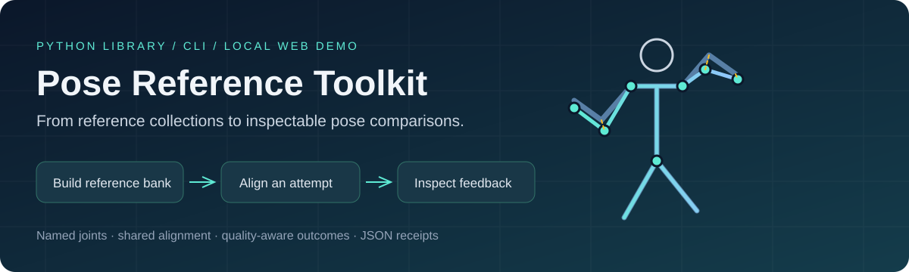
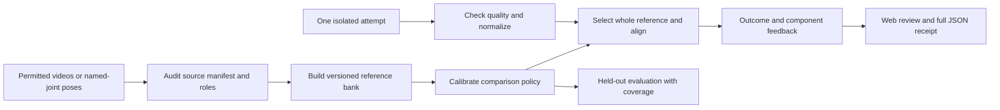
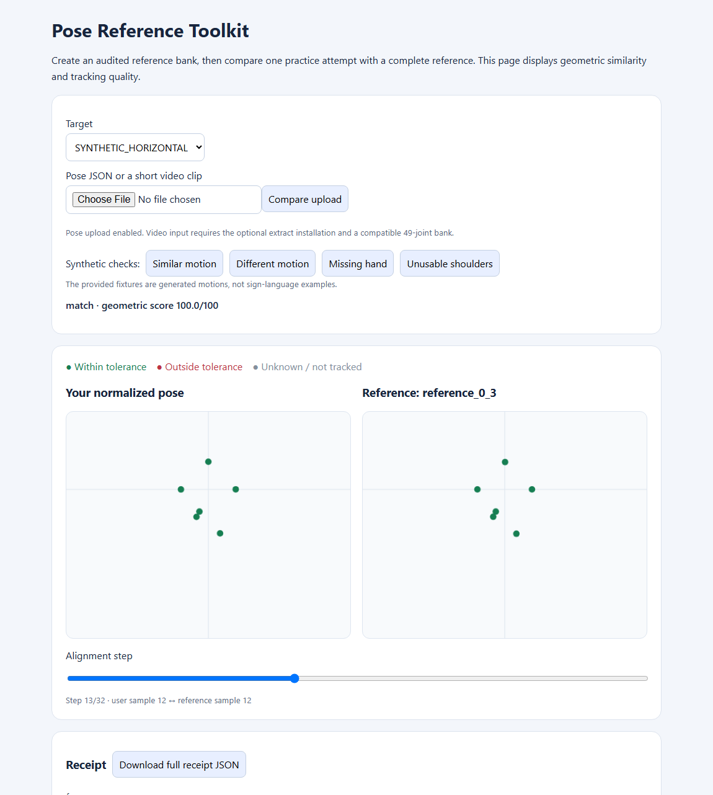

# Pose Reference Toolkit

[](https://github.com/ntthienphuc/pose-reference-toolkit/actions/workflows/ci.yml)
[](https://github.com/ntthienphuc/pose-reference-toolkit/releases)
[](LICENSE)
[](pyproject.toml)

**Turn a permitted reference collection into a reusable pose comparison workflow.** Build a bank from video or named-joint poses, compare an isolated attempt, inspect where it differs, and save the complete result for review.

[Quick start](#quick-start) · [Your collection](#use-your-own-collection) · [Python API](#python-api) · [Reproduce](REPRODUCE.md) · [Method](docs/METHOD.md) · [Paper evidence](docs/SOFTWAREX_POSITIONING.md)

## What you can build

A Python library and CLI for developers who need reference-based motion comparison without training a recognizer for each collection. A small local web demo shows how to integrate the same bank, policy and comparison API into an upload-and-review application.



| Task | Toolkit output |
|---|---|
| Curate an existing collection | Accepted/excluded source report, hashes, role-overlap checks, versioned bank |
| Compare an attempt | Selected complete exemplar, linear or bounded-DTW alignment, target/alternative margin |
| Inspect the comparison | Aligned pose overlay, per-joint/group discrepancy and downloadable full receipt |
| Handle uncertain inputs | `low_similarity`, `inconclusive`, `needs_recapture` or `reject`, with reasons |
| Assess an operating policy | Bank-bound calibration and evaluation retaining failures and scoring coverage |

**Scores describe 2D geometric similarity under the declared configuration.** They are not validated sign-language proficiency grades. Public example motions are synthetic; natural sign matching and educational benefit remain unevaluated.

## Quick start

Python 3.10 or newer for the core/server. Use Python 3.11 for the separately tested optional video adapter.

```sh
git clone https://github.com/ntthienphuc/pose-reference-toolkit.git
cd pose-reference-toolkit
python -m venv .venv
# Windows PowerShell:
.venv\Scripts\Activate.ps1
# Linux/macOS: source .venv/bin/activate
python -m pip install -e ".[server,dev]"
pose-ref demo --out demo_run
pose-ref serve --bank demo_run/bank --policy demo_run/policy.json --demo-root demo_run
```

Open <http://127.0.0.1:8010>. Try **matching motion**, **different motion**, **missing tracking** and **degenerate anchors**. Move the alignment slider, inspect the overlay, then select **Download full receipt JSON** to retain the exact comparison including its path and reference identity.



*Screenshot of the generated synthetic demo; this is an engineering example, not a person performing a sign.*

```sh
pose-ref compare --bank demo_run/bank --pose demo_run/example_same.json --target SYNTHETIC_HORIZONTAL --policy demo_run/policy.json
python -m unittest discover -s tests -v
```

The demo creates 16 synthetic files: eight references, four calibration files and four evaluation files across two motion classes. It deliberately exercises successful, different-motion and unusable-input outcomes. Its rates describe that fixture only. Use a new output directory when repeating a run.

## Use your own collection

Supply deliberately trimmed single-attempt clips or compatible pose JSON files, confirmed labels and documented permission. A manifest row looks like this:

```json
{"schema_version": 1, "samples": [
  {"id":"hello_ref_01", "gloss":"HELLO", "path":"clips/hello_01.mp4",
   "kind":"video", "role":"reference", "source_group":"capture_01",
   "license":"YOUR documented permission or license", "authorized":true}
]}
```

This is a schema example, not permission to use a dataset. A build needs **2–64 accepted references per gloss**, so supply multiple reference rows. Add disjoint `calibration` and `evaluation` rows to fit and assess thresholds. Paths resolve within the manifest directory. A declared source group is not a verified signer identity.

```sh
# Optional extraction adapter: Python 3.11 with supported platform wheels.
python -m pip install -e ".[server,extract]"
pose-ref audit --manifest collection/sources.json
pose-ref build --manifest collection/sources.json --out collection/bank_v1
pose-ref calibrate --manifest collection/sources.json --bank collection/bank_v1 --out collection/policy.json
pose-ref evaluate --manifest collection/sources.json --bank collection/bank_v1 --policy collection/policy.json --out collection/evaluation.json
pose-ref serve --bank collection/bank_v1 --policy collection/policy.json
```

The optional MediaPipe Holistic adapter produces 49 named joints with frame-index/FPS timestamps and assumes constant frame rate. The six-joint synthetic bank has a different contract: extracted videos require a bank built from compatible poses. Hand confidence indicates detection presence, not a calibrated joint probability. See [contracts](docs/CONTRACTS.md) and [real-case protocol](docs/CASE_STUDY_PROTOCOL.md).

## Python API

```python
from pose_reference import ReferenceBank, compare
from pose_reference.pose import load_pose
from pose_reference.evaluation import load_policy

bank = ReferenceBank("demo_run/bank")
policy = load_policy("demo_run/policy.json", bank)
result = compare(load_pose("demo_run/example_same.json"),
                 bank, "SYNTHETIC_HORIZONTAL", policy)
print(result["status"], result["score"], result.get("matched_reference_id"))
```

`linear` is the default alignment. Bounded `dtw` uses one path shared across required joints. Both select a complete reference exemplar: the displayed reference and feedback explain the same comparison that produced the score. A policy fitted for one alignment must be recalibrated before use with another.

## Evidence and contribution

The contribution is an integrated **reference-bank lifecycle, coherent temporal comparison and inspectable assessment workflow**. Extraction, normalization, DTW and educational feedback have prior art. [The comparison with actual related implementations](docs/RELATED_WORK.md) explains that overlap; [positioning](docs/SOFTWAREX_POSITIONING.md) defines the supported contribution and remaining experiments.

| Available evidence | Practical boundary |
|---|---|
| Synthetic outcomes and regression cases | Tested behavior on constructed motions; no natural-sign accuracy claim |
| API/HTTP tests and real Chromium checks | Interface behavior, complete receipt downloads and mobile layout |
| Built-wheel/source checks and CI | Packaging and installation checks for the tested environments |
| Fixed-fixture host timing script | Comparison time only; no extraction/network or scale-up claim |
| Real-data evaluation tooling | Implemented; an authorized natural-data study is still needed |

Evaluation retains unreadable and recapture inputs and distinguishes all-pair rates from rates conditional on a score. Report both with coverage; zero false matches alone can conceal a system that scores nothing. See [metric denominators](docs/METHOD.md#diagnostic-denominators-and-coverage).

## Documentation and reuse

[Reproduction](REPRODUCE.md) · [Data contracts](docs/CONTRACTS.md) · [Method](docs/METHOD.md) · [Limitations](docs/LIMITATIONS.md) · [Related work](docs/RELATED_WORK.md) · [Case-study protocol](docs/CASE_STUDY_PROTOCOL.md) · [Software metadata](docs/SOFTWARE_METADATA.md) · [Contributing](CONTRIBUTING.md)

The web server is a local demonstration, with temporary server-side uploads and no production authentication. This is a standalone software release, not a published SoftwareX article. Cite the version using [CITATION.cff](CITATION.cff), and report issues through [GitHub Issues](https://github.com/ntthienphuc/pose-reference-toolkit/issues).

## License and provenance

Toolkit source and generated synthetic fixtures are **MIT licensed**, copyright Nguyễn Trần Thiên Phúc. Dependencies retain their own terms; see [third-party notices](THIRD_PARTY_NOTICES.md). No private participant videos, banks, checkpoints or application credentials are included. Publicly accessible data are not automatically licensed for transformation or redistribution.

This independent implementation is separated from the original practice app and does not inherit its evaluation results, classifier or coordinate/angular scoring. Since v0.1.1 the distribution is `pose-reference-toolkit`, imports are `pose_reference`, and the CLI is `pose-ref`; use a fresh environment when migrating from the initial prototype.
